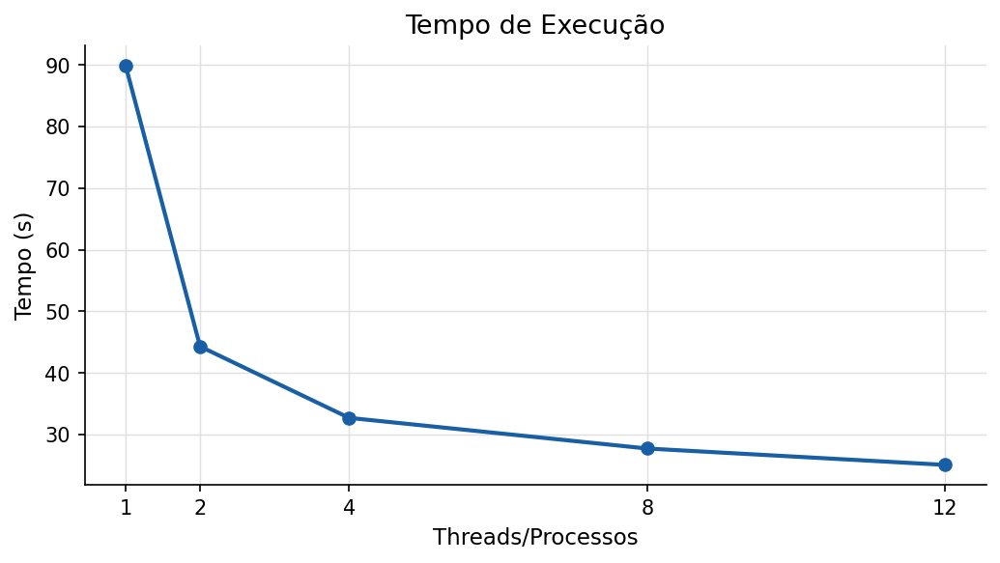
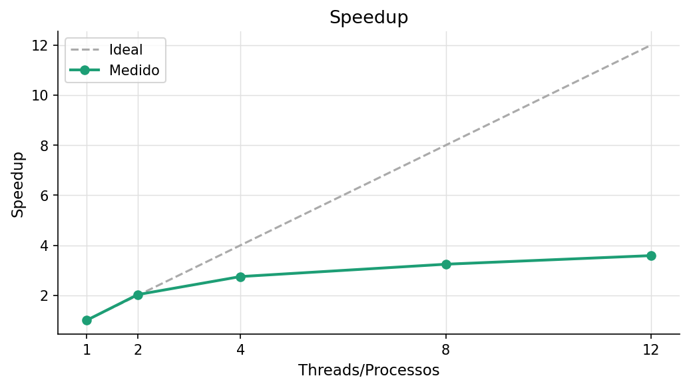
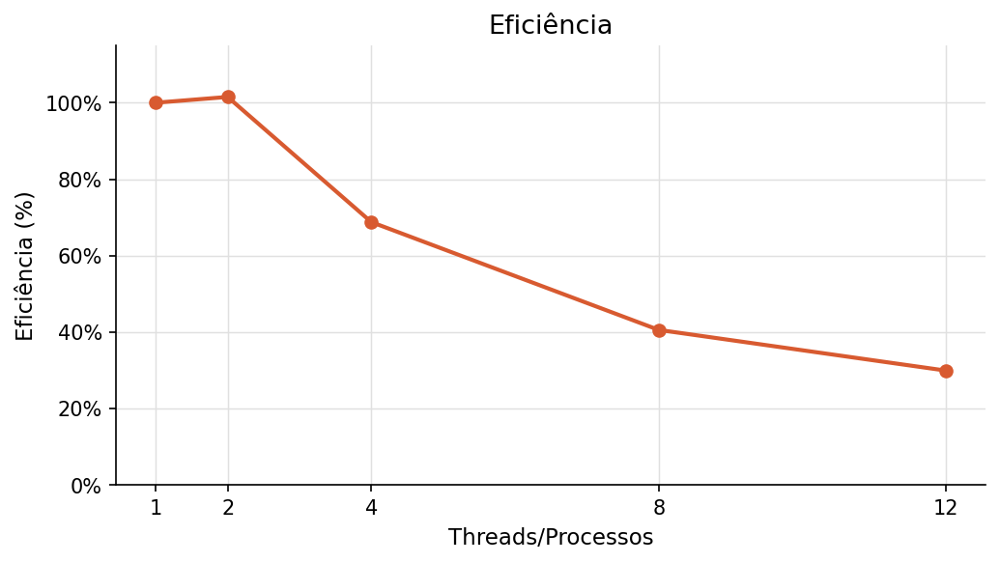

# Relatório de Análise de Desempenho - Atividade 3

**Disciplina:** PROGRAMAÇÃO CONCORRENTE E DISTRIBUÍDA  
**Aluno:** João Victor Fernandes  
**Turma:** ADS  
**Professor:** Rafael Marconi  
**Data:** 25/03/2026  

---

# 1. Descrição do Problema

O programa resolve o problema de processamento e análise de grandes volumes de logs textuais. O sistema percorre uma massa de dados para extrair o total de linhas, palavras, caracteres e realiza a contagem das palavras-chave: **"erro"**, **"warning"** e **"info"**.

* **Algoritmo:** Foi utilizado o modelo **Produtor-Consumidor** com buffer limitado (`multiprocessing.JoinableQueue`).
* **Tamanho da Entrada:** 1.000 arquivos de log (pasta `log2`), totalizando 10.000.000 de linhas.
* **Objetivo:** O objetivo da paralelização é reduzir o tempo total de resposta (latency) ao distribuir a carga de leitura e processamento entre os múltiplos núcleos da CPU, superando o gargalo da execução sequencial.
* **Complexidade:** Aproximadamente $O(n \times m)$, onde $n$ é o número de arquivos e $m$ o número de linhas por arquivo.

---

# 2. Ambiente Experimental

| Item                        | Descrição |
| --------------------------- | --------- |
| Processador                 | 12th Gen Intel(R) Core(TM) i7-12700 |
| Número de núcleos           | 12 Núcleo(s) |
| Memória RAM                 | 16,0 GB |
| Sistema Operacional         | Windows |
| Linguagem utilizada         | Python 3.x |
| Biblioteca de paralelização | Multiprocessing (stdlib) |
| Compilador / Versão         | Python 3.x |

---

# 3. Metodologia de Testes

Os experimentos foram conduzidos medindo o tempo total de execução ("Wall Time") utilizando a função `time.perf_counter()`.

* **Execuções:** Foi realizada uma medição para cada configuração de processos.
* **Entrada:** Massa de teste fixa (pasta `log2`) com 1.000 arquivos.
* **Configurações:** Testes realizados com 1 (serial), 2, 4, 8 e 12 processos.
* **Condições:** Execução em máquina local, com carga de sistema variável (processos de fundo do SO ativos).

---

# 4. Resultados Experimentais

| Nº Threads/Processos | Tempo de Execução (s) |
| -------------------- | --------------------- |
| 1 (Serial)           | 89.9118               |
| 2                    | 44.2864               |
| 4                    | 32.6888               |
| 8                    | 27.7172               |
| 12                   | 25.0590               |

---

# 6. Tabela de Resultados (Cálculos)

| Threads/Processos | Tempo (s) | Speedup | Eficiência |
| ----------------- | --------- | ------- | ---------- |
| 1                 | 89.9118   | 1.0000  | 1.0000     |
| 2                 | 44.2864   | 2.0302  | 1.0151     |
| 4                 | 32.6888   | 2.7505  | 0.6876     |
| 8                 | 27.7172   | 3.2439  | 0.4055     |
| 12                | 25.0590   | 3.5880  | 0.2990     |

---

# 7. Gráfico de Tempo de Execução

# 8. Gráfico de Speedup

# 9. Gráfico de Eficiência

---

# 10. Análise dos Resultados

* **O speedup obtido foi próximo do ideal?** Apenas na configuração de 2 processos (2.03), onde superou ligeiramente o ideal. Para 4, 8 e 12 processos, o speedup ficou bem abaixo do linear esperado.
* **A aplicação apresentou escalabilidade?** Sim, mas com rendimento decrescente. O tempo continua caindo conforme adicionamos processos, mas o ganho marginal torna-se pequeno após 4 processos.
* **Em qual ponto a eficiência começou a cair?** A eficiência caiu drasticamente após 2 processos, saindo de 1.01 para 0.68 com 4 processos, chegando a apenas 0.29 com 12.
* **Houve overhead de paralelização?** Sim. O principal overhead observado é a disputa por recursos de I/O (disco) e o gerenciamento de IPC (Inter-Process Communication) através da Fila (`Queue`).
* **Causas da perda de desempenho:** Como o processador i7-12700 possui núcleos de performance e eficiência, a alocação de tarefas em núcleos diferentes e a contenção de leitura de 1.000 arquivos simultâneos no disco rígido/SSD limitam o ganho que a CPU poderia oferecer.

---

# 11. Conclusão

* **Desempenho:** O paralelismo foi eficaz, reduzindo o tempo de processamento de ~90s para ~25s.
* **Melhor Configuração:** Em termos de tempo bruto, 12 processos foi o melhor. Em termos de custo-benefício (eficiência), a configuração com **2 processos** foi a ideal.
* **Escalabilidade:** O programa escala, mas é limitado pelo gargalo de entrada/saída (I/O Bound).
* **Melhorias:** Uma implementação utilizando leitura assíncrona ou processamento de arquivos em lotes (batching) poderia reduzir a contenção na fila e melhorar a eficiência com 8 ou 12 processos.
